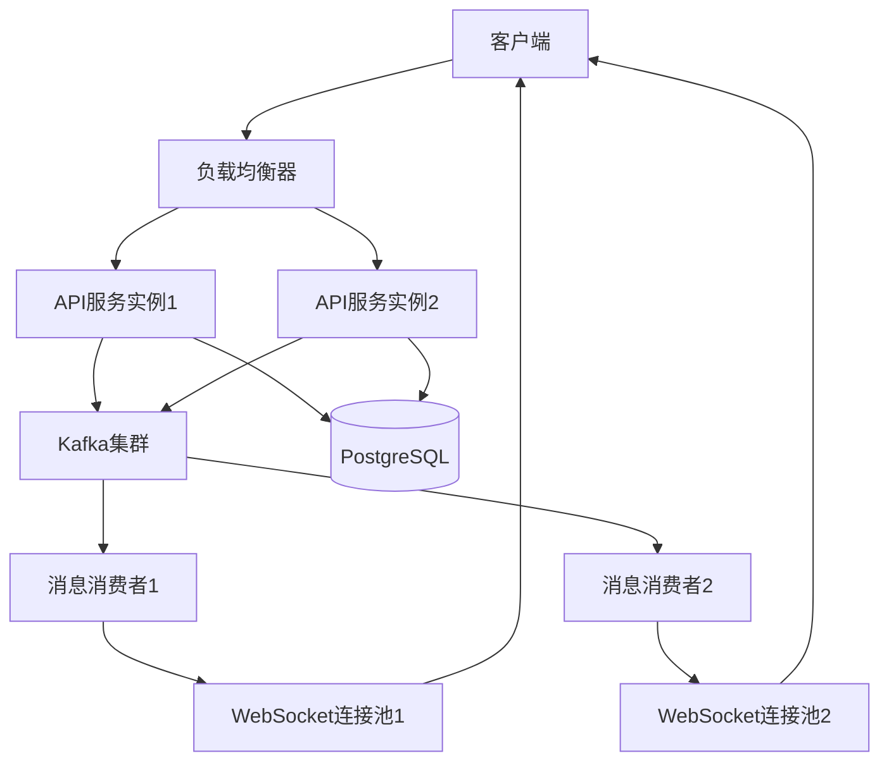
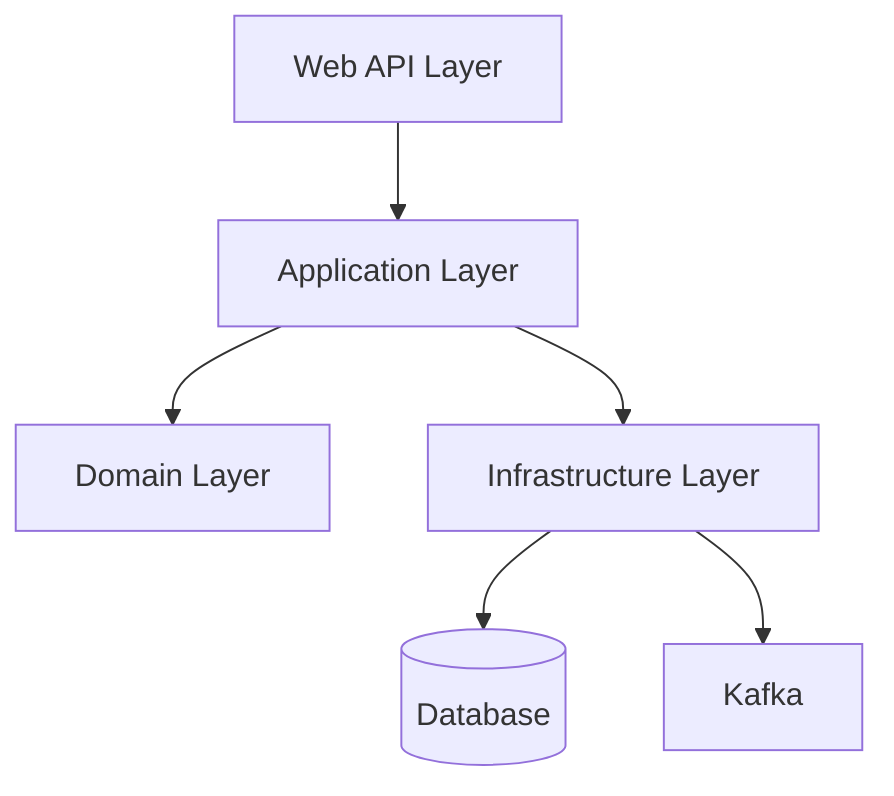

# 系统概述和架构设计

## 🎯 项目概述

本设计文档描述了一个基于Rust技术栈的高性能聊天室后台系统。系统采用清洁架构（Clean Architecture）设计模式，使用tokio作为异步运行时，axum作为web框架，kafka作为消息队列中间件，PostgreSQL作为持久化存储。

### 🛠️ 核心技术栈

- **Runtime**: tokio (异步运行时)
- **Web Framework**: axum (HTTP/WebSocket服务)
- **Message Queue**: Apache Kafka (消息队列和事件流)
- **Database**: PostgreSQL (数据持久化)
- **Serialization**: serde (JSON序列化)
- **Logging**: tracing (结构化日志)
- **Configuration**: figment (配置管理)
- **Async Traits**: async-trait (异步trait支持)
- **HTTP Middleware**: tower-http (CORS和tracing中间件)

### 🏗️ 架构原则

- **异步优先**: 全面使用async/await模式处理I/O操作
- **事件驱动**: 基于Kafka的事件驱动架构
- **水平扩展**: 支持多实例部署和负载均衡
- **故障隔离**: 单个连接或组件故障不影响整体系统
- **渐进式实现**: 基于YAGNI原则，分阶段实现功能，避免过度工程化

## 📋 分阶段实现策略

基于需求分析，我们将功能分为Core和Enterprise Extensions两个阶段：

### 🎯 Phase 1: Core功能（MVP）

**目标**: 实现基本的聊天室功能，支持生产环境部署

**包含功能**:

- 用户认证（JWT）
- 基本聊天室（创建、加入、离开）
- 实时消息（WebSocket）
- 消息历史查询
- 基本的房间管理（公开/私密房间）
- WebSocket心跳和重连
- 基础错误处理和日志

**数据模型简化**:

```rust
// Phase 1 简化的实体
pub struct User {
    pub id: Uuid,
    pub username: String,
    pub email: String,
    pub avatar_url: Option<String>,
    pub status: UserStatus,
    pub created_at: DateTime<Utc>,
    pub updated_at: DateTime<Utc>,
}

pub struct ChatRoom {
    pub id: Uuid,
    pub name: String,
    pub description: Option<String>,
    pub owner_id: Uuid,
    pub is_private: bool,
    pub password_hash: Option<String>,
    pub created_at: DateTime<Utc>,
    pub updated_at: DateTime<Utc>,
}

pub struct Message {
    pub id: Uuid,
    pub room_id: Uuid,
    pub user_id: Uuid,
    pub content: String,
    pub message_type: MessageType,
    pub created_at: DateTime<Utc>,
}

// 预留扩展字段（JSONB）
pub struct UserExtensions {
    pub user_id: Uuid,
    pub extensions: serde_json::Value, // 存储未来的扩展字段
}
```

### 🔧 Phase 2: Enterprise扩展（可选）

**目标**: 在Core功能稳定后，根据实际需求添加企业级功能

**包含功能**:

- 组织层级管理
- 用户角色和权限系统
- 部门和职位管理
- 代理关系
- 机器人消息
- 用户在线时长统计
- 高级管理员功能

**实现策略**:

- 通过功能开关（feature flags）控制启用/禁用
- 扩展现有数据模型，不破坏Core功能
- 独立的服务模块，可选择性部署

### ⚙️ 配置驱动的功能控制

```rust
#[derive(Debug, Deserialize, Serialize)]
pub struct FeatureFlags {
    pub enable_organizations: bool,
    pub enable_user_roles: bool,
    pub enable_proxy_system: bool,
    pub enable_bot_messages: bool,
    pub enable_online_statistics: bool,
    pub enable_advanced_admin: bool,
}

impl Default for FeatureFlags {
    fn default() -> Self {
        Self {
            enable_organizations: false,
            enable_user_roles: false,
            enable_proxy_system: false,
            enable_bot_messages: false,
            enable_online_statistics: false,
            enable_advanced_admin: false,
        }
    }
}

// 在服务中使用功能开关
impl ChatRoomService {
    pub async fn send_message(&self, command: SendMessageCommand) -> Result<Message> {
        // Core功能：基本消息发送
        let message = self.create_message(command).await?;
        
        // Enterprise功能：检查组织权限（可选）
        if self.feature_flags.enable_organizations {
            self.organization_service.check_user_permission(command.user_id).await?;
        }
        
        // 发送消息到Kafka
        self.kafka_producer.send_event(ChatEvent::MessageSent {
            message: message.clone(),
            room_id: command.room_id,
        }).await?;
        
        Ok(message)
    }
}
```

### 🗄️ 数据库设计的前向兼容性

```sql
-- Phase 1: Core表结构
CREATE TABLE users (
    id UUID PRIMARY KEY DEFAULT gen_random_uuid(),
    username VARCHAR(255) NOT NULL UNIQUE,
    email VARCHAR(255) NOT NULL UNIQUE,
    avatar_url VARCHAR(255),
    status VARCHAR(20) DEFAULT 'active',
    created_at TIMESTAMP WITH TIME ZONE DEFAULT NOW(),
    updated_at TIMESTAMP WITH TIME ZONE DEFAULT NOW()
);

-- 预留扩展表（Phase 2时使用）
CREATE TABLE user_extensions (
    user_id UUID PRIMARY KEY REFERENCES users(id) ON DELETE CASCADE,
    extensions JSONB DEFAULT '{}', -- 存储扩展字段
    created_at TIMESTAMP WITH TIME ZONE DEFAULT NOW(),
    updated_at TIMESTAMP WITH TIME ZONE DEFAULT NOW()
);

-- Phase 2时添加的表（通过迁移脚本）
-- CREATE TABLE organizations (...);  -- 仅在启用组织功能时创建
-- CREATE TABLE user_roles (...);     -- 仅在启用角色功能时创建
```

这种分阶段的方法确保了：

1. **快速上线**: Core功能可以快速开发和部署
2. **风险控制**: 避免一次性实现过多复杂功能
3. **需求验证**: 在实际使用中验证哪些Enterprise功能真正需要
4. **架构兼容**: 为未来扩展预留空间，但不增加当前复杂性

## 🏛️ 系统架构

### 系统架构图



### 分层架构



### 架构层次说明

#### 🌐 Web API Layer（Web API层）

- **职责**: 处理HTTP请求和WebSocket连接
- **组件**: REST API端点、WebSocket处理器、认证中间件
- **技术**: Axum框架、JWT认证、CORS处理

#### 🔧 Application Layer（应用层）

- **职责**: 协调领域对象和基础设施，实现应用用例
- **组件**: 命令处理器、查询处理器、应用服务
- **模式**: CQRS模式（命令查询职责分离）

#### 🎯 Domain Layer（领域层）

- **职责**: 包含核心业务逻辑和领域模型
- **组件**: 实体、值对象、领域服务、领域事件
- **原则**: 业务逻辑独立，不依赖外部技术

#### 🏗️ Infrastructure Layer（基础设施层）

- **职责**: 提供技术支持，实现领域层定义的接口
- **组件**: 数据库访问、Kafka消息队列、Redis缓存、WebSocket管理
- **模式**: 仓储模式、适配器模式

### 🔄 数据流向

1. **HTTP请求流向**:

   ```
   客户端 → Load Balancer → API实例 → Application Layer → Domain Layer → Infrastructure Layer → Database
   ```

2. **WebSocket消息流向**:

   ```
   客户端 → WebSocket连接 → MessageRouter → Application Layer → Kafka → MessageConsumer → WebSocket广播
   ```

3. **事件驱动流向**:

   ```
   业务操作 → Domain Event → Kafka Producer → Kafka Topic → Kafka Consumer → 处理逻辑 → 结果通知
   ```

### 📊 扩展性设计

#### 水平扩展

- **无状态服务**: API实例无状态，可以水平扩展
- **数据分片**: 基于房间ID的消息路由，确保同一房间的消息有序
- **故障转移**: 自动检测和恢复故障实例

#### 性能优化

- **连接池**: 数据库连接池、Redis连接池
- **缓存策略**: 热点数据缓存、查询结果缓存
- **异步处理**: 所有I/O操作异步化，提高吞吐量

#### 监控和运维

- **结构化日志**: 使用tracing记录详细日志
- **指标收集**: 业务指标和技术指标的监控
- **健康检查**: 服务健康状态监控和报警

## 🎯 关键设计决策

### 清洁架构选择理由

- **业务逻辑隔离**: 核心业务逻辑独立于技术细节
- **可测试性**: 各层独立，便于单元测试和集成测试
- **可维护性**: 清晰的职责分离，降低维护成本
- **可扩展性**: 新功能可以通过扩展实现，不影响现有代码

### 事件驱动架构优势

- **解耦合**: 系统组件间通过事件通信，降低耦合度
- **可扩展性**: 消息队列支持水平扩展和负载均衡
- **可靠性**: 消息持久化确保数据不丢失
- **异步处理**: 提高系统响应速度和吞吐量

### 分阶段实现策略

- **风险控制**: 避免一次性实现过多复杂功能
- **快速验证**: Core功能快速上线，验证市场需求
- **资源优化**: 根据实际需求投入资源，避免浪费
- **渐进演进**: 架构支持渐进式演进，不影响现有功能

---

**下一步**: 阅读[02-domain-layer-design.md](./02-domain-layer-design.md)了解领域层的详细设计。
